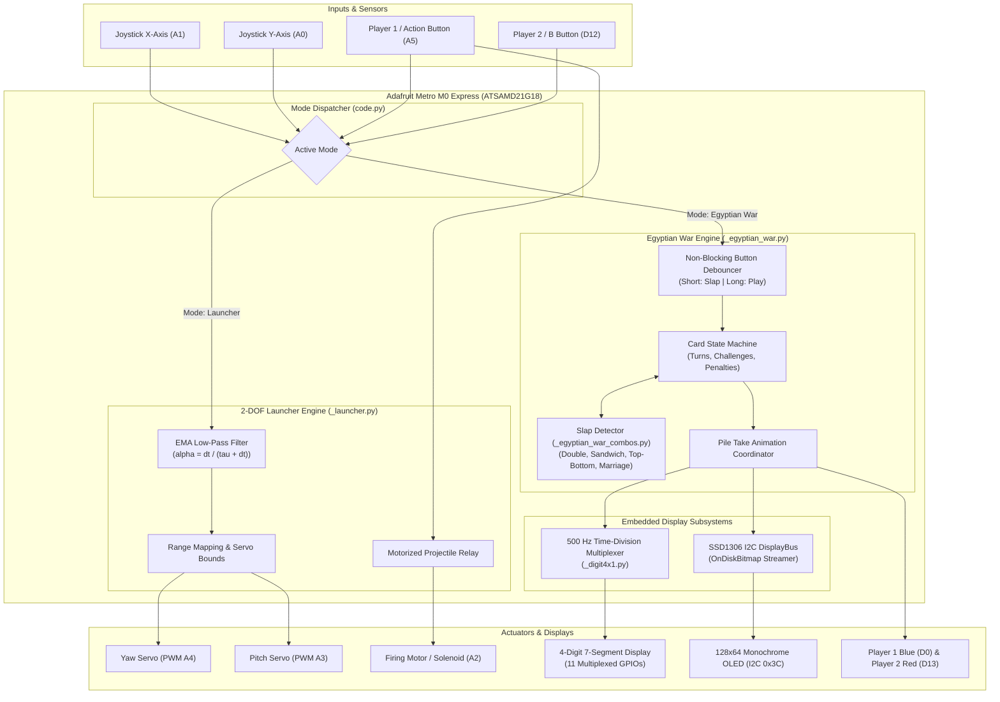

# Egyptian War Machine

[](#awards--recognition)
[](https://www.adafruit.com/product/3505)
[](https://circuitpython.org/)
[](../LICENSE)

> **Awarded both Best Engineering Design and People’s Choice (out of 21 teams)** at the **UC San Diego SIPP Hackathon**, September 2026.

**Egyptian War Machine** is an embedded gaming and robotics platform built on the Adafruit Metro M0 Express. It features a dual-mode architecture: an interactive two-player reflex card game (Egyptian War / Egyptian Rat Screw) rendered on an I2C OLED with multiplexed 7-segment scoring, and an analog-guided 2-DOF motorized projectile (LEGO) launcher.

[Video](https://drive.google.com/file/d/1T_9Ks87VnYDBUHqNeeMATJvqaxq6kMD4/view?usp=sharing)

---

## Highlights

* **Double Hackathon Honors**: Awarded both **Best Engineering Design** and **People’s Choice** (out of 21 competing engineering teams) at the UCSD SIPP Hackathon.
* **Dual-Feature Mechatronics**: Engineered a dual-feature system comprising an OLED high-speed reflex card game and a precision 2-DOF motorized pan-tilt projectile launcher.
* **Asynchronous Embedded Architecture**: Designed non-blocking firmware coordinating card game state machines, 500 Hz time-division multiplexed 7-segment score displays, SSD1306 OLED sprite rendering, and animated player transitions within 32 KB RAM.

---

## Table of Contents

- [System Architecture](#system-architecture)
- [Hardware & Pinout](#hardware--pinout)
- [Deep Technical Implementation](#deep-technical-implementation)
  - [1. Dual-Feature Modular Firmware Architecture](#1-dual-feature-modular-firmware-architecture)
  - [2. 2-DOF Motorized Launcher with Exponential Moving Average (EMA) Filtering](#2-2-dof-motorized-launcher-with-exponential-moving-average-ema-filtering)
  - [3. Egyptian War Reflex Game Engine & Slap Combination Detector](#3-egyptian-war-reflex-game-engine--slap-combination-detector)
  - [4. Time-Division Multiplexed 4-Digit 7-Segment Driver (Anti-Ghosting)](#4-time-division-multiplexed-4-digit-7-segment-driver-anti-ghosting)
  - [5. Zero-RAM Bitmap Streaming via SSD1306 I2C OLED](#5-zero-ram-bitmap-streaming-via-ssd1306-i2c-oled)
  - [6. Non-Blocking Button Debounce & Dual-Action Input Multiplexing](#6-non-blocking-button-debounce--dual-action-input-multiplexing)
- [Software Structure](#software-structure)
- [Build & Deployment](#build--deployment)

---

## System Architecture



---

## Hardware & Pinout

All peripherals interface directly with the Adafruit Metro M0 Express without external display controller ICs, offloading logic entirely into optimized firmware:

| Peripheral / Interface | Metro M0 Pin | Signal Type | Role / Function |
| :--- | :--- | :--- | :--- |
| **Joystick X-Axis** | `board.A1` | `AnalogIn` (16-bit ADC) | Yaw control input for pan servo ($0 - 65535$) |
| **Joystick Y-Axis** | `board.A0` | `AnalogIn` (16-bit ADC) | Pitch control input for tilt servo ($0 - 65535$) |
| **Yaw Pan Servo** | `board.A4` | `PWMOut` (50 Hz) | Horizontal servo ($0^\circ - 180^\circ$ actuation) |
| **Pitch Tilt Servo** | `board.A3` | `PWMOut` (50 Hz) | Vertical elevation servo ($19^\circ - 79^\circ$ physical safety limits) |
| **Motorized Firing Trigger**| `board.A2` | `DigitalInOut` (Output) | Projectile launch actuation signal |
| **Player 1 / A Button** | `board.A5` | `DigitalInOut` (Input) | Player 1 action button (Short: Slap / Long: Play card / Launcher: Fire) |
| **Player 2 / B Button** | `board.D12` | `DigitalInOut` (Input) | Player 2 action button (Short: Slap / Long: Play card) |
| **Player 1 Status LED (Blue)**| `board.D0`| `DigitalInOut` (Output) | Active turn and victory indicator for Player 1 |
| **Player 2 Status LED (Red)** | `board.D13`| `DigitalInOut` (Output) | Active turn and victory indicator for Player 2 |
| **SSD1306 OLED (SDA)** | `board.SDA` | Hardware `I2C` (0x3C) | 128x64 display bus data line |
| **SSD1306 OLED (SCL)** | `board.SCL` | Hardware `I2C` (0x3C) | 128x64 display bus clock line |
| **7-Segment Segment A** | `board.D1` | `DigitalInOut` (Output) | Top horizontal bar |
| **7-Segment Segment B** | `board.D6` | `DigitalInOut` (Output) | Top-right vertical bar |
| **7-Segment Segment C** | `board.D10` | `DigitalInOut` (Output) | Bottom-right vertical bar |
| **7-Segment Segment D** | `board.D9` | `DigitalInOut` (Output) | Bottom horizontal bar |
| **7-Segment Segment E** | `board.D7` | `DigitalInOut` (Output) | Bottom-left vertical bar |
| **7-Segment Segment F** | `board.D2` | `DigitalInOut` (Output) | Top-left vertical bar |
| **7-Segment Segment G** | `board.D8` | `DigitalInOut` (Output) | Center horizontal bar |
| **7-Segment Common Digit 1** | `board.D3` | `DigitalInOut` (Output) | Player 1 tens place selector |
| **7-Segment Common Digit 2** | `board.D4` | `DigitalInOut` (Output) | Player 1 units place selector |
| **7-Segment Common Digit 3** | `board.D5` | `DigitalInOut` (Output) | Player 2 tens place selector |
| **7-Segment Common Digit 4** | `board.D11` | `DigitalInOut` (Output) | Player 2 units place selector |

Note that **all** GPIO pins are in use; 2 GPIO pins were saved by omitting the `.` (DP) pin of the 4x1 7-segment diplay and the green component of the RGB LED.

The pin layout also avoids clock collisions, since there are a limited number of clocks to use for PWM and other hardware timing.

---

## Technical Implementation

### 1. Dual-Feature Modular Firmware Architecture

The system has two complete embedded projects within a unified codebase:
* In **Launcher Mode** ([_launcher.py](_launcher.py)), the processor operates as a high-speed closed-loop control system, sampling analog potentiometers at $1000\,\text{Hz}$ and actuating dual PWM channels.
* In **Egyptian War Mode** ([_egyptian_war.py](_egyptian_war.py)), the processor runs an asynchronous state machine coordinating card game rules, bitmap blitting via I2C, and continuous GPIO multiplexing.

---

### 2. 2-DOF Motorized Launcher with EMA Filtering

Analog inputs from sensitive potentiometers suffer from mechanical vibration, wiper bounce, ADC quantization noise, and even electrical noise from high current draw by servos. Driving hobby servos with raw ADC readings causes jitter, high noise, and excessive stall current.

To resolve this, [_launcher.py](_launcher.py) implements a discrete first-order Exponential Moving Average (EMA) Low-Pass Filter:

$$y[k] = \alpha \cdot x[k] + (1 - \alpha) \cdot y[k-1]$$

Where the smoothing coefficient $\alpha$ is derived from the loop tick rate ($f_{\text{tick}} = 1000\,\text{Hz}$, $\Delta t = 1\,\text{ms}$) and desired physical response time constant ($\tau = 10\,\text{ms}$):

$$\alpha = \frac{\Delta t}{\tau + \Delta t} = \frac{0.001}{0.010 + 0.001} \approx 0.0909$$

```python
def ema_filter(
    alpha: float, current_value: float, previous_filtered_value: float | None = None
) -> float:
    if previous_filtered_value is None:
        return current_value
    return alpha * current_value + (1 - alpha) * previous_filtered_value
```

This filter provides a tunable compromise: high-frequency ADC noise ($> 50\,\text{Hz}$) is heavily attenuated, while rapid stick deflections remain instantaneous to human perception ($< 15\,\text{ms}$ phase lag).

#### Servo Calibration & Safety Clamping
Physical mechanical linkages restrict elevation travel. The firmware employs bounded mapping in [_util.py](_util.py):
* **Yaw**: Mapped linearly from raw ADC ($0 - 65535$) across $0^\circ$ to $180^\circ$ (pulse range: $575\,\mu\text{s} - 2400\,\mu\text{s}$).
* **Pitch**: Inverted and restricted to $19^\circ$ to $79^\circ$, preventing the mechanical barrel from binding or over-torquing against the baseplate.

---

### 3. Egyptian War Reflex Game Engine & Slap Combination Detector

The Egyptian War engine ([_egyptian_war.py](_egyptian_war.py)) models the full ruleset of Egyptian Rat Screw with deterministic validation:

#### Card & Deck Representation
To minimize memory overhead on the 32 KB microcontroller, cards are stored as single compact integers:
$$\text{Card} \in [0, 51] \implies \text{Suit} = \lfloor \text{Card} / 13 \rfloor, \quad \text{Rank} = \text{Card} \pmod{13}$$

A standard 52-card deck is initialized and shuffled using an in-place **Fisher-Yates shuffle algorithm**, then partitioned evenly ($2 \times 26$ cards) into player hands.

#### Reflex Slap Combinations
In [_egyptian_war_combos.py](_egyptian_war_combos.py), combo patterns are evaluated dynamically against the card pile, ignoring burned penalty cards at the bottom:

1. **Double**: Two cards of identical rank placed consecutively:
   $$\text{Rank}(\text{pile}[-1]) = \text{Rank}(\text{pile}[-2])$$
2. **Sandwich**: Two identical ranks separated by one intermediate card:
   $$\text{Rank}(\text{pile}[-1]) = \text{Rank}(\text{pile}[-3])$$
3. **Top-Bottom**: Top card matches the original bottom card of the pile:
   $$\text{burned} = 0 \quad \land \quad \text{Rank}(\text{pile}[-1]) = \text{Rank}(\text{pile}[0])$$
4. **Marriage**: Consecutive King and Queen cards in any sequence.

#### Face Card Challenge Logic
Playing a face card issues a counter-challenge granting the opponent a limited number of chances to play another face card:
* **Jack**: 1 chance
* **Queen**: 2 chances
* **King**: 3 chances
* **Ace**: 4 chances

If the challenged player fails to produce a face card before chances expire, the challenger earns the right to slap and claim the pile.

#### Slap Penalty
If a player slaps incorrectly (when no valid combo or challenge exists), the player is penalized: **2 cards are burned** from their hand directly to the bottom of the central pile (`burned += 2`), voiding Top-Bottom combos and encouraging accurate plays.

---

### 4. Time-Division Multiplexed 4-Digit 7-Segment Driver (Anti-Ghosting)

To display both players' hand counts in real time (e.g., `2626` = 26 cards each) without dedicated display driver ICs (like MAX7219 or TM1637), [_digit4x1.py](_digit4x1.py) drives the display using direct GPIO time-division multiplexing:

$$\text{Pin Count} = 7\,\text{segment pins} + 4\,\text{digit select pins} = 11\,\text{pins}$$

(Note that the `.` (DP) pin is unused.)

#### High-Frequency Refresh & Anti-Ghosting
The driver refreshes digits sequentially at **500 Hz** (`UPDATE_RATE = 500`), far surpassing human flicker fusion threshold (~60 Hz). To prevent visual ghosting (bleeding of segments across adjacent digits):
1. The currently active digit common pin is deactivated.
2. The segment GPIO bus is updated with the pre-computed bitmask for the new digit.
3. The next digit common pin is energized.

```python
def update(self) -> None:
    common_anode = self.common_anode
    # Deactivate current digit (prevent ghosting)
    self.digits[self.current_digit].value = not common_anode
    # Advance to next digit
    self.current_digit = digit = (self.current_digit + 1) % 4
    pattern = self._patterns[digit]
    bit = 1
    for segment in reversed(self.segments):
        segment.value = (pattern & bit != 0) ^ common_anode
        bit <<= 1
    # Energize new digit
    self.digits[digit].value = common_anode
```

#### Cooperative Asynchronous Integration
Because CircuitPython is single-threaded (no multithreading supporting), long blocking pauses (`time.sleep()`) would cause the multiplexed display to extinguish or stick on a single digit. The firmware solves this with [`updated_sleep()`](_egyptian_war.py#L162-L167):

```python
def updated_sleep(seconds: float) -> None:
    start_time = get_time()
    while get_time() - start_time < seconds:
        digit4x1.update()
        sleep(1.0 / UPDATE_RATE)
```
This guarantees constant Persistence of Vision (POV) even during card dealing delays and game animations.

---

### 5. Disk Bitmap Streaming via SSD1306 I2C OLED

Storing the currently displayed graphical card bitmap in RAM on an ATSAMD21 (32 KB total SRAM) is feasible but leaves too little memory for features.

The graphics pipeline in [_egyptian_war.py](_egyptian_war.py) solves this using CircuitPython's `displayio.OnDiskBitmap`:
* All 52 playing card faces have been pre-rendered into monochrome bitmap assets in [cards-bmp/](cards-bmp/) (each precisely 642 bytes, 44x64 resolution).
* When a card is played, the firmware streams the bitmap data directly from the external SPI Flash file system into the SSD1306 OLED frame buffer via I2C, entirely bypassing the microcontroller's RAM heap:
  ```python
  def load_card_layer(card: Card) -> displayio.TileGrid:
      bitmap = displayio.OnDiskBitmap(f"cards-bmp/{get_name(card)}.bmp")
      return displayio.TileGrid(
          bitmap, pixel_shader=bitmap.pixel_shader, x=_x_position, y=0
      )
  ```

#### Animated Pile Claims
When a player wins a pile, the firmware animates the event:
* Hand counts on the 7-segment display interpolate upward in real time.
* In parallel, the winning player's indicator LED pulses at 5 Hz (80% duty cycle) for a nice visual effect.
* Display multiplexing runs continuously throughout the animation.

---

### 6. Non-Blocking Button Debounce & Dual-Action Input Multiplexing

Each player controls both of their actions (place, slap) through a single physical tactile pushbutton. In [_util.py](_util.py), the `Button` class implements non-blocking state debouncing distinguishing between the two actions:

```
[Button Down] ─────────────────────┐
                                   ▼
                     Duration < 200 ms?  ─── Yes ──► SHORT_PRESS (Slap Pile)
                                   │
                                  No
                                   ▼
                            LONG_PRESS (Play Card)
```

* **Short Press (< 200 ms)**: High-speed slap reaction to take the pile.
* **Long Press ($\ge 200$ ms)**: Intentional card deal on the player's active turn.

This eliminates accidental card dealing during rapid reflex slapping while halving the required physical button count.

---

## Software Structure

```
egyptian-war-machine/
├── cards-bmp/                  # 52 monochrome card bitmaps (44x64, 642 bytes each)
├── code.py                     # Pin definitions, hardware bus init, mode switcher
├── _launcher.py                # 2-DOF joystick EMA filter and servo aim loop
├── _egyptian_war.py            # Card game state machine, rendering, scoring loop
├── _egyptian_war_combos.py     # Slap combo algorithms (Double, Sandwich, Marriage)
├── _digit4x1.py                # 500 Hz time-division 7-segment multiplexer
├── _card.py                    # Card bit-packing and suit/rank utilities
├── _util.py                    # Math range mapping, EMA filter, Button debouncer
├── launcher.mpy                # Pre-compiled bytecode (-O3)
├── egyptian_war.mpy            # Pre-compiled bytecode (-O3)
├── egyptian_war_combos.mpy     # Pre-compiled bytecode (-O3)
├── digit4x1.mpy                # Pre-compiled bytecode (-O3)
├── card.mpy                    # Pre-compiled bytecode (-O3)
└── util.mpy                    # Pre-compiled bytecode (-O3)
```

---

## Build & Deployment

### Prerequisites
* Adafruit Metro M0 Express with **CircuitPython 9.x+**
* `adafruit_displayio_ssd1306` library in `CIRCUITPY/lib/`
* `adafruit_motor` library in `CIRCUITPY/lib/`

### 1. Compile Source to Bytecode
Run the compilation script in Git Bash or WSL:
```bash
./compile.sh
```

### 2. Configure Mode
In [code.py](code.py#L57-L66), select the desired operating mode:
* Set `if True:` on line 57 for the **2-DOF Motorized Launcher**.
* Set `if False:` on line 57 for the **Egyptian War Card Game**.

This could have been done more elegantly but there was not enough time left to implement a better solution.

### 3. Deploy to Hardware
Copy the contents of `egyptian-war-machine/` to the root of your `CIRCUITPY` drive:
```
CIRCUITPY/
├── cards-bmp/
├── code.py
├── card.mpy
├── digit4x1.mpy
├── egyptian_war.mpy
├── egyptian_war_combos.mpy
├── launcher.mpy
└── util.mpy
```
Upon file transfer completion, CircuitPython automatically reboots into the selected mode.
