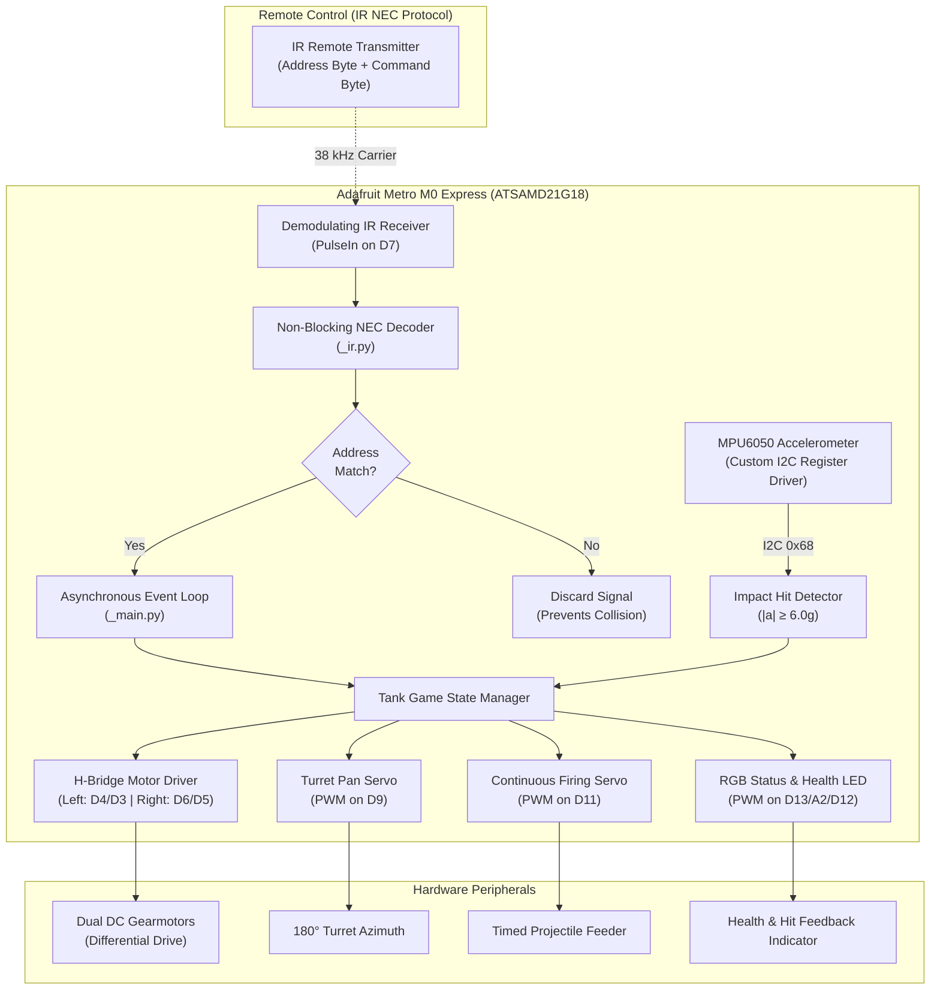
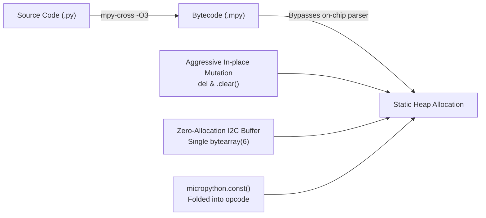

# Tiny Tanks

[-gold.svg)](#awards--recognition)
[](https://www.adafruit.com/product/3505)
[](https://circuitpython.org/)
[](../LICENSE)

> **Awarded Best Project (1st of 7 teams)** at the **UC San Diego Summer Internship Preparatory Program (SIPP)**, September 2026.

**Tiny Tanks** is an embedded real-time, two-player wireless combat tank game built on the Adafruit Metro M0 Express. The system features differential drive propulsion, an independently actuated pan turret, a continuous-servo projectile firing routine, accelerometer-based impact detection, multi-state battle injury mechanics, and a custom non-blocking NEC infrared communication protocol engine engineered to run reliably within a strict 32 KB RAM size.

[Slides](https://docs.google.com/presentation/d/1WQiBEisVg-VB_Z7gBrMVnCJ5no2UjBza7oZm0h-AR4Y/edit?usp=sharing)

---

## Highlights

* **1st Place Award**: Earned Best Project (1st of 7 teams) at UCSD SIPP for a two-player wireless tank game with aimable turrets.
* **Firmware & Motion Control**: Programmed differential steering, dynamic hit detection, injury-based health degradation, and single-push projectile firing.
* **Low-Level Protocol Implementation**: Implemented non-blocking NEC infrared decoding with address validation, completely eliminating multi-user signal collisions in competitive matches.
* **Embedded Optimization**: Overcame 32 KB RAM hardware limitations via driver source re-engineering, memory footprint minimization, and MicroPython pre-compilation (`mpy-cross -O3`).

---

## Table of Contents

- [System Architecture](#system-architecture)
- [Hardware & Pinout](#hardware--pinout)
- [Deep Technical Implementation](#deep-technical-implementation)
  - [1. Non-Blocking NEC IR Protocol Engine](#1-non-blocking-nec-ir-protocol-engine)
  - [2. Multi-User Address Validation & Collision Avoidance](#2-multi-user-address-validation--collision-avoidance)
  - [3. Bare-Metal MPU6xxx I2C Driver & Hit Detection](#3-bare-metal-mpu6xxx-i2c-driver--hit-detection)
  - [4. Differential Steering & Actuation](#4-differential-steering--actuation)
  - [5. Injury-Based Health System & Invulnerability Windows](#5-injury-based-health-system--invulnerability-windows)
  - [6. Overcoming the 32 KB RAM Constraint](#6-overcoming-the-32-kb-ram-constraint)
- [Software Structure](#software-structure)
- [IR Remote Configuration](#ir-remote-configuration)
- [Build & Deployment](#build--deployment)

---

## System Architecture



---

## Hardware & Pinout

The system is hosted on an **Adafruit Metro M0 Express** powered by a Microchip ATSAMD21G18 (48 MHz ARM Cortex-M0+, 32 KB SRAM, 256 KB Flash).

| Peripheral / Subsystem | Metro M0 Pin | Interface / Mode | Description |
| :--- | :--- | :--- | :--- |
| **IR Demodulator** | `board.D7` | `PulseIn` (Input, idle high) | 38 kHz demodulated IR sensor receiver (120-pulse ring buffer) |
| **Left Motor Forward (IN2)** | `board.D4` | `DigitalInOut` (Output) | H-Bridge driver left track forward polarity |
| **Left Motor Backward (IN1)**| `board.D3` | `DigitalInOut` (Output) | H-Bridge driver left track backward polarity |
| **Right Motor Forward (IN4)**| `board.D6` | `DigitalInOut` (Output) | H-Bridge driver right track forward polarity |
| **Right Motor Backward (IN3)**| `board.D5` | `DigitalInOut` (Output) | H-Bridge driver right track backward polarity |
| **Turret Azimuth Servo** | `board.D9` | `PWMOut` (50 Hz) | 180° standard positional servo for turret rotation |
| **Continuous Firing Servo**| `board.D11` | `PWMOut` (50 Hz) | Continuous-rotation servo driving projectile feeding mechanism |
| **Status RGB LED - Red** | `board.D13` | `PWMOut` | Red channel for damage alerts and low health indicator |
| **Status RGB LED - Green** | `board.A2` | `PWMOut` | Green channel for medium health indication |
| **Status RGB LED - Blue** | `board.D12` | `PWMOut` | Blue channel for full health (3 HP) indication |
| **MPU6050 IMU (I2C SDA)** | `board.SDA` | Hardware `I2C` (0x68) | Collision and physical impact shock detection |
| **MPU6050 IMU (I2C SCL)** | `board.SCL` | Hardware `I2C` (0x68) | I2C clock line |

---

## Technical Implementation

### 1. Non-Blocking NEC IR Protocol Engine

Standard vendor libraries (e.g., standard `adafruit_irremote`) present two critical architectural bottlenecks in resource-constrained real-time applications:
1. **Blocking Delays**: Functions like `read_pulses()` block microcontroller execution until a transmission ends or times out, stalling motor control, turret tracking, and physics updates.
2. **Exception Overhead**: NEC repeat frames (9ms burst + 2.25ms pause) raise `IRNECRepeatException`, generating high garbage collection (GC) churn and latency spikes on an ARM Cortex-M0+.

To resolve this, a modified version of the `NonblockingGenericDecode` class was used.

---

### 2. Multi-User Address Validation & Collision Avoidance

In a two-player arena, multiple remotes transmitting across the 38 kHz optical channel cause cross-talk. Each remote transmits an NEC frame consisting of:

$$\text{Frame} = [\text{Header}] + [\text{Address}] + [\overline{\text{Address}}] + [\text{Command}] + [\overline{\text{Command}}]$$

The firmware reads each remote's distinct address byte from [commands.txt](commands.txt):
* Tank 1 Address: `0xFF`
* Tank 2 Address: `0xF7`

During message parsing in [`IRRemote.update()`](_main.py#L154-L185), incoming frames are filtered by the configured tank address:

```python
if isinstance(message, ir.IRMessage):
    if len(message.code) < 2:
        continue
    identity = message.code[1]
    if identity != self.identity:
        continue  # Discard frame intended for opponent's tank
    ...
```

Unparseable signals caused by optical packet collisions are dropped silently rather than raising exceptions, ensuring the state machine preserves vehicle stability even under heavy RF/IR noise.

---

### 3. Bare-Metal MPU6xxx I2C Driver & Hit Detection

Off-the-shelf CircuitPython IMU libraries consume over 12 KB of heap memory and instantiate numerous temporary objects per sample. To conserve memory, a bare-metal register driver was written in [_mpu6xxx.py](_mpu6xxx.py) based off of the library source code, using the same low-level I2C bus transactions:

* **Direct Register Control**: Wakes the MPU6050 by zeroing `PWR_MGMT_1` (`0x6B`) and configures acceleration full-scale range to $\pm 16\text{g}$ via `ACCEL_CONFIG` (`0x1C` = `0x18`).
* **Zero-Allocation Buffer**: Pre-allocates a static 6-byte `bytearray(6)` buffer reused for all bus reads:
  ```python
  def read_acceleration_g(self) -> float:
      buffer = self.read_register(_MPU6xxx_ADDR, _ACCEL_XOUT_H, self.buffer)
      ax, ay, az = unpack(">hhh", buffer)
      return sqrt(ax * ax + ay * ay + az * az) / _ACCEL_SCALE_16G
  ```
* **Threshold Detection**: At $\pm 16\text{g}$ full-scale range, sensitivity is $2048\,\text{LSB/g}$. The Euclidean norm of the acceleration vector is evaluated:

$$\|\vec{a}\| = \frac{\sqrt{a_x^2 + a_y^2 + a_z^2}}{2048.0} \ge 6.0\,\text{g}$$

An impact $\ge 6.0\,\text{g}$ indicates a physical collision or projectile hit, registering damage in the game engine.

---

### 4. Differential Steering & Actuation

Vehicle motion utilizes a 4-bit bitmask state representation driving an H-bridge:

| State | Left Forward (`in2`) | Left Backward (`in1`) | Right Forward (`in4`) | Right Backward (`in3`) | Vehicle Motion |
| :--- | :---: | :---: | :---: | :---: | :--- |
| `_COAST` (`0b00`) | 0 | 0 | 0 | 0 | Inertial Roll / Idle |
| `_FORWARD` (`0b01` / `0b01`) | 1 | 0 | 1 | 0 | Straight Forward |
| `_BACKWARD` (`0b10` / `0b10`)| 0 | 1 | 0 | 1 | Straight Reverse |
| `_LEFT` (`0b10` / `0b01`) | 0 | 1 | 1 | 0 | High-Torque Counter-Clockwise Pivot |
| `_RIGHT` (`0b01` / `0b10`) | 1 | 0 | 0 | 1 | High-Torque Clockwise Pivot |
| `_BRAKE` (`0b11` / `0b11`) | 1 | 1 | 1 | 1 | Active Dynamic Braking |

#### Turret Positioning & Idle De-energizing
The turret servo operates between calibrated pulse widths of **575 µs** ($0^\circ$) and **2400 µs** ($180^\circ$). To prevent servo gear chatter, continuous high-current stall draw, and electrical noise from disturbing the I2C bus:
* When an azimuth angle command completes, the firmware de-energizes the servo by setting `servo.angle = None` (0% PWM duty cycle).
* The physical gearing maintains turret hold while servo power drops to near zero.

#### Timed Projectile Firing
Pressing `CENTER` triggers a non-blocking single-push firing cycle:
1. Continuous servo runs at full throttle (`-1.0`) to actuate the feed wheel.
2. An automatic timer runs for `_FIRING_DURATION = 0.75s`.
3. An internal firing invulnerability window (`0.80s`) is engaged to prevent self-impact false positives from the launcher's mechanical recoil.
4. Servo throttle returns to `0.0` automatically.

---

### 5. Injury-Based Health System & Invulnerability Windows

Each tank begins the match with 3 Health Points. Dynamic damage feedback reinforces gameplay:

1. **RGB Health State**:
   * **3 HP**: Pure Blue `(0.0, 0.0, 1.0)`
   * **2 HP**: Pure Green `(0.0, 1.0, 0.0)`
   * **1 HP**: Warning Amber `(1.0, 0.5, 0.0)`
   * **0 HP (Eliminated)**: Dead Red `(1.0, 0.0, 0.0)` — motors immediately coast and lock out.
2. **Battle Damage Degradation**:
   When damaged, the turret's rotational slew rate degrades linearly:
   $$\omega_{\text{turret}} \leftarrow \omega_{\text{turret}} - \frac{\omega_{\text{initial}}}{\text{Max Health}} = 20^\circ/\text{s} - \frac{20^\circ/\text{s}}{3} \approx 13.3^\circ/\text{s} \to 6.7^\circ/\text{s}$$
3. **Hit Invulnerability & Flash**:
   Taking damage triggers a 1.0-second invulnerability window and initiates a 3 Hz red strobe at 50% duty cycle, preventing cascading multi-hit triggers from a single impact event.

---

### 6. Overcoming the 32 KB RAM Constraint

The Microchip ATSAMD21G18 microcontroller provides 32 KB SRAM. CircuitPython's VM and runtime stack require approximately 18 KB, leaving only ~14 KB heap for application objects, buffers, and bytecode. Standard Python scripts rapidly triggered heap fragmentation and `MemoryError` faults.

Four key optimizations eliminated memory failure:



1. **MicroPython Cross-Compilation (`mpy-cross -O3`)**:
   Code is pre-compiled on the host via [compile.sh](../compile.sh) using optimization level `-O3`. This strips docstrings, removes line numbers, and bypasses the memory-intensive on-chip Python tokenization and compilation passes.
2. **Integer Constant Inlining**:
   All state flags, timing thresholds, and register addresses are declared using `micropython.const()`, allowing the compiler to fold constants directly into VM opcodes instead of allocating heap integer objects.
3. **Explicit Scope Pruning**:
   In [_ir.py](_ir.py), intermediate pulse arrays are aggressively pruned via `del` statements (`del evens, even_bins`, `del odds, odd_bins`, `del pulse_bins`, `del outliers`, `del parity_pulses`) and lists are modified in-place (`.clear()`, slice assignment `[:]`) rather than re-allocated.
4. **Custom Minimal Device Drivers**:
   Replacing full Adafruit driver bundles with minimal register-level drivers reduced RAM usage by over **65%**.
5. **Code Size Reduction**:
   All code was designed to be as compact and space efficient as possible in order to further reduce program instructions memory usage.

---

## Software Structure

```
tiny-tanks/
├── commands.txt      # IR identity codes and key mappings
├── code.py           # Entry point (boots main.mpy)
├── _main.py          # Tank state machine, game loop, motor & servo coordinator
├── _ir.py            # Non-blocking NEC IR decoder and packet parser
├── _mpu6xxx.py       # Bare-metal I2C register driver for MPU6050 accelerometer
├── _servo.py         # Calibrated positional and continuous PWM servo drivers
├── main.mpy          # Pre-compiled bytecode (-O3)
├── ir.mpy            # Pre-compiled bytecode (-O3)
├── mpu6xxx.mpy       # Pre-compiled bytecode (-O3)
└── servo.mpy         # Pre-compiled bytecode (-O3)
```

---

## IR Remote Configuration

Remote identities and button codes are loaded dynamically from [commands.txt](file:///c:/Users/user/development/sipp/tiny-tanks/commands.txt) following the format:

```
IDENTITY;UP,LEFT,DOWN,RIGHT,CENTER,UP_LEFT,UP_RIGHT[-DESCRIPTION]
```

### Supported Remotes
* **Numbered Remote (Default)**: `FF;9D,DD,57,3D,FD,5D,1D-numbered`
* **Colored Remote**: `F7;5F,EF,4F,AF,6F,DF,9F-colored`
* **Fan Remote**: `FE;87,B7,DF,9F,07,XX,XX-fan`

---

## Build & Deployment

### Prerequisites
* Microchip SAMD21 board running **CircuitPython 9.x+**
* `mpy-cross-windows-10.2.1.static.exe` (included in repository root) or host-specific `mpy-cross`

### 1. Compile Source to Bytecode
Run the compilation script in Git Bash or WSL:
```bash
./compile.sh
```
This scans all `_*.py` files and generates optimized `.mpy` bytecode binaries.

### 2. Flash to Hardware
Copy the following files to the root of your `CIRCUITPY` drive:
```
CIRCUITPY/
├── code.py
├── commands.txt
├── ir.mpy
├── main.mpy
├── mpy6xxx.mpy
└── servo.mpy
```
Upon file transfer completion, CircuitPython automatically reboots and executes the game.
